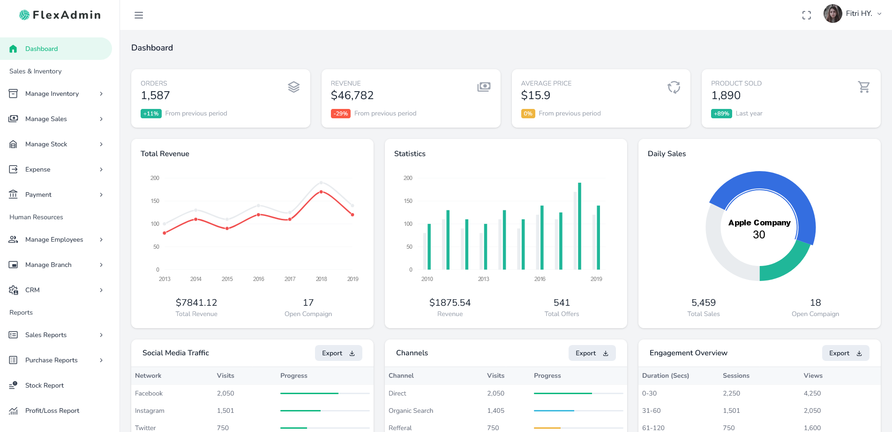

# Office DataCentral

Office DataCentral is a desktop application template designed for backoffice and data management needs. Templates based on modern technologies such as Node.js and other support tools that provide a strong and flexible foundation for your backoffice applications. This template is ideal for developers who want to build desktop applications with complete backoffice functionality and a responsive user interface.

### Installation Templates

#### Installation:
- Clone the repository and run `npm install` to install all required dependencies.
- Run npm run `create-db` to manually create and initialize the SQLite database in `db/createDB.js`.

#### Development:
- Use `npm run dev` to start the application in development mode with hot reloading and see changes live.

#### Build:
- Run `npm run build` to build the application for distribution and generate installation files for various platforms. The application build results will be in the `build` folder and ready for production.

#### Running Application:
- Use `npm start` to run Electron applications and access the basic backoffice template interface.
